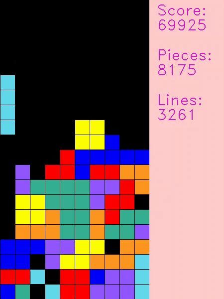

# [PYTORCH] Deep Q-learning for playing Tetris

## Introduction

Here is my python source code for training an agent to play Tetris. It uses a double DQN (Deep Q-Network) with PER (Prioritized Experience Replay).

   
  <i>Tetris demo</i>

The full demo can be found at [here](https://youtu.be/KTb5R5UUdDc).

## How it works
### States & Actions
The input of the model is a list of states, each of them is reached by taking a particular action from the previous state. The state is characterized by 4 variables, which are [heuristically](https://codemyroad.wordpress.com/2013/04/14/tetris-ai-the-near-perfect-player/) believed to be enough for Tetris. The 4 variables are:
- Number of lines cleared: captures immediate rewards
- Number of holes created: captures local disadvantage
- Bumpiness: captures global disadvantage
- Height: captures global disadvantage

Instead of characterize the actions by *move left*, *move right* and *rotate* at each time step, we are taking a different approach and characterize the actions by:
- Number of rotations:
	- For line, square and Z-shape tetrominos, #rotation = {0, 1}
	- For L-shape and T-shape tetrominos, #rotation= {0, 1, 2, 3}
- Location to drop:
	- This is an integer between 0 and the width of the board, given that the location is valid (all parts of the tetromino is in the board).

To put these together, the input of the model is of shape (N, C):
- N is the number of possible actions at that current state. N = # of possible rotations * # of possible places to put the tetrimino
- C is the number of attribute we track to make a decision. C = 4 in this case.

### Model
The bare-bone deep Q-Learning model is adapted from [here](https://github.com/uvipen/Tetris-deep-Q-learning-pytorch), the objective is to minimize the MSE of $r_t + \gamma \space max(q(s_{t+1}))-q(s_j)$.

$$\large J(\textbf{w}) = \textbf{E}_{(s_t, a_t, r_t, s_{t+1})}[(y_t^{DQN} - \hat{q}(s_t, a_t, \textbf{w}))^2]$$

$y_t^{DQN}$ for one-step estimator learning target is basically the same as TD(0):

$$\large y_t^{DQN} = r_t + \gamma \space \underset{a'}{max}[\hat{q}(s_{t+1}, a', \textbf{w}^-]$$

Since this is a value-based approach, the optimal policy is found by picking the action that could optimize the value function given a particular state.

Furthermore, I added some functionalities to the training algorithm to allow faster and more efficient training. Taking the ideas from the [AlphaGo paper](https://www.nature.com/articles/nature16961) and the [Prioritized Experience Replay paper](https://arxiv.org/abs/1511.05952), I implmented double Q-learning and prioritized experience replay to achieve better sample efficiency.

### Double Deep Q-Learning
The benefit of double deep Q-learning is twofold.
1. It reduces [maximization bias](https://towardsdatascience.com/double-deep-q-networks-905dd8325412).
2. It helps stabilize training by avoiding "chasing a moving target".

Maximization bias is introduced in Q-learning when we take the maximum of various Q-value approximations. To resolve this, we need to separate the evaluation and action selection into two networks. This has been [shown](https://papers.nips.cc/paper/3964-double-q-learning) to significanty speed up training time by eliminating suboptimal actions more quickly than normal Q-learning.

Furthermore, we can update the evaluation network (target network) periodically instead of updating at every step of training. By doing so, we are not using a constantly shifting set of values to adjust our network; therefore, preventing from falling into a feedback loop between the target and estimated Q-value. By setting the the target network constant for a certain number of steps, the behaviour of the RL agent is also stabilized. The frequency at which the target updates is an important parameter, setting the frequency too high would deteriorate the stabilization effects, setting it too low inhibits learning.

$y_t^{DoubleDQN}$ for one-step estimator learning target is shown below. W represents the weights for the Q-value estimation networks and W' is the weights for the target network.

$$\large y_t^{DoubleQ} = r_t + \gamma \space \hat{q}(s_{t+1}, \underset{a'}{argmax}[\hat{q}(s_{t+1}, a', \textbf{w})], \textbf{w}')$$

### Prioritized Experience Replay
Data collected by the RL agent is usally not iid, unlike supervised learning. The reward you will get at the next timestep is highly related to the reward you have at the current timestep. To improve data efficiency and remove sample correlations, minibatch is sampled from a pool of stored experiences, called replay buffer.

In the original implementation, the experience replay is random. In this [paper](https://arxiv.org/abs/1511.05952), Tom Schaul states that some experiences may be more important than others. They could be game changers but they don't occur often; whereas some less important experience may occur frequently. Thus, if we uniformly sample the replay buffer, we might not be able to sample the game changers many times before it's pushed out of the replay buffer.

To tackle this problem, we assign a priority value based on TD error. `(state, action, reward, next_state)` tuple with high error should be selected more often during the training process. The priority value for stochastic prioritization is defined as below:

$$\large P(i) = \frac{p_i^a}{\Sigma_k \space p_k^a}$$

where:
- P(i) is the priority value
- pi is the TD error
- a is a hyperparameter used to introduce some randomness in the experience replay process
  - If a is 0, pure randomness (like the original model)
  - If a is 1, we always selects the experience with the highest priorities
- The summation in the denominator acts as a normalization by all priority values in the replay buffer.

Implementation using a normal deque or an array (in random experience replay) wouldn't be computationally efficient in this case, as both insertion and sampling are both O(n) per sample in the minibatch. Rather, using a data structure like priority queue would allow O(logn) for both insertion and sampling. In my implementation, a [SumTree](https://adventuresinmachinelearning.com/sumtree-introduction-python/) is used.

## How to use my code

With my code, you can:
* **Train your model from scratch** by running **python train.py**
* **Test your trained model** by running **python test.py**

## Trained models

You could find my trained model at **trained_models/tetris**
 
## Requirements

* **python 3.6**
* **PIL**
* **cv2**
* **pytorch** 
* **numpy**
* **matplotlib**

## Acknowledgement
I learned and explored many of the above concepts from [CS234](https://web.stanford.edu/class/cs234/index.html) at Stanford, which is an awesome course to get a comprehensive Intro to RL.

Thanks [unipen](https://github.com/uvipen) for the baseline model, which I based off to develop Double Q-Learning and Prioritized Experience Replay.